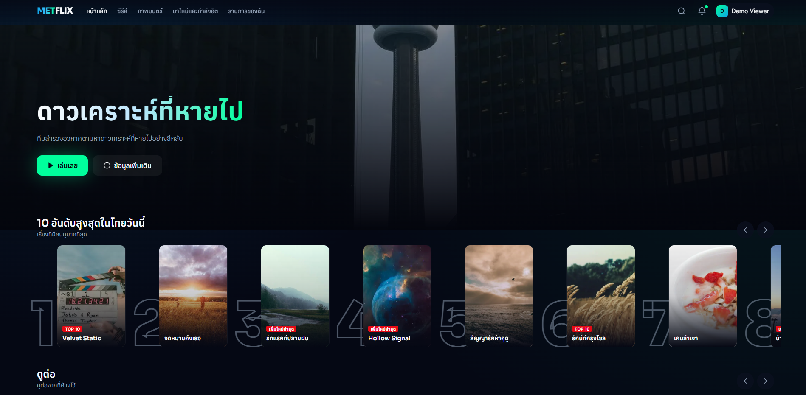
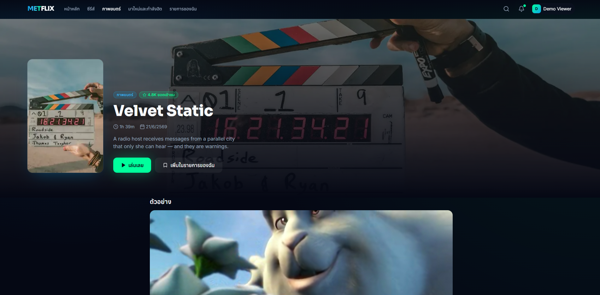
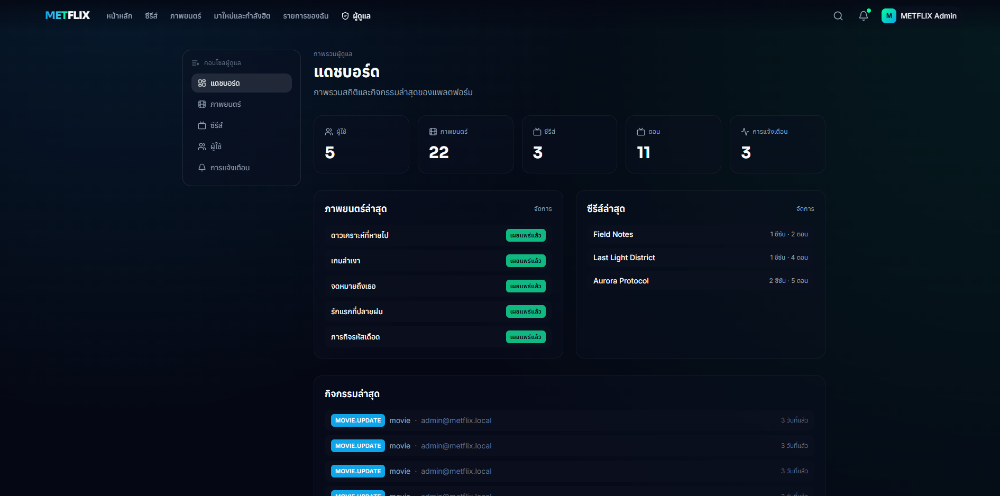

# METFLIX


METFLIX is a Netflix-style streaming platform for movies and series. It pairs a cinematic dark UI with a home page built from a Top 10 row and genre category rows, title search, personal watch lists, resume-where-you-left-off playback, and multiple viewer profiles per account. A separate admin console manages the catalog and users.

The project is a full-stack monorepo. The frontend is a Next.js 14 App Router app and the backend is a NestJS API on PostgreSQL. All database access is raw parameterized SQL through `pg`, with no ORM and no query builder. Every list endpoint is paginated and every admin write is recorded to an audit log. The full stack runs from a single `docker compose up`.

---

## Screenshots

<p align="center">
  
  
</p>
<p align="center">
  
  
</p>

---

## Features

### Browsing and discovery

- Home page with a hero banner, a Top 10 row with rank numbers, and a separate row for each genre (Series, Korean drama, Anime, Action, Comedy, Horror, Romance, and more).
- Dedicated Movies, Series, and New and Popular pages.
- Title pages with artwork, metadata, and, for series, a season switcher and full episode list.
- Cards expand into a hover preview with quick play, add-to-list, and details actions.
- Editorial badges on cards: New, Top 10, New episode, and New season.

### Search

- A slide-out search bar in the navbar that filters movies and series as you type.
- Debounced queries and shareable result URLs.

### Profiles

- Multiple viewer profiles per account with a "Who is watching" chooser on entry.
- Profile management to create, rename, delete, and pick a preset avatar, up to five profiles per account.
- My List and Continue watching are tracked separately for each profile, with an in-app profile switcher.

### Watching

- HTML5 video player that saves progress, resumes from the last position, and offers the next episode for series.

### Personal

- My List to save any movie or series in one place.
- Notifications for new releases and admin messages, with read state and an unread badge.
- Account page with display name, avatar, and watch stats.

### Admin console

- Dashboard with catalog and user totals plus a recent activity feed.
- Manage movies, series, seasons, and episodes: create, edit, publish, and delete.
- Tag each title with a genre and a highlight badge that drives the home page rows.
- User directory with search.
- Broadcast a notification to everyone or target a single user.

### Platform

- JWT authentication with user and admin roles and route guards.
- Validated request bodies on every write and pagination on every list endpoint.
- Self-hosted notifications module, structured for a future WebSocket gateway.
- Thai-localized interface.

---

## Tech stack

| Layer | Technologies |
| ----- | ------------ |
| Frontend | Next.js 14 (App Router), React 18, TypeScript, Tailwind CSS, Framer Motion, TanStack Query, Zustand, React Hook Form, Zod |
| Backend | NestJS 10, TypeScript, raw SQL via `pg`, JWT with bcryptjs, class-validator |
| Database | PostgreSQL 16 |
| Tooling | Docker, Docker Compose, npm workspaces |

---

## Project structure

```
apps/
  web/    Next.js App Router frontend (browse, search, watch, profiles, admin)
  api/    NestJS REST API, organized by domain module:
          auth, users, profiles, movies, series, seasons,
          episodes, watchlist, watch-history, notifications, admin
packages/
  shared-types/   TypeScript types shared by the web app and the API
```
